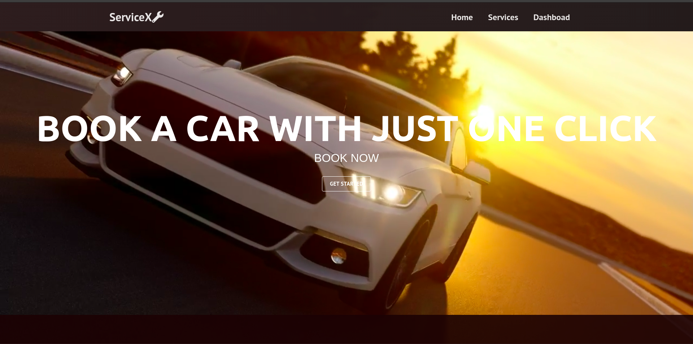
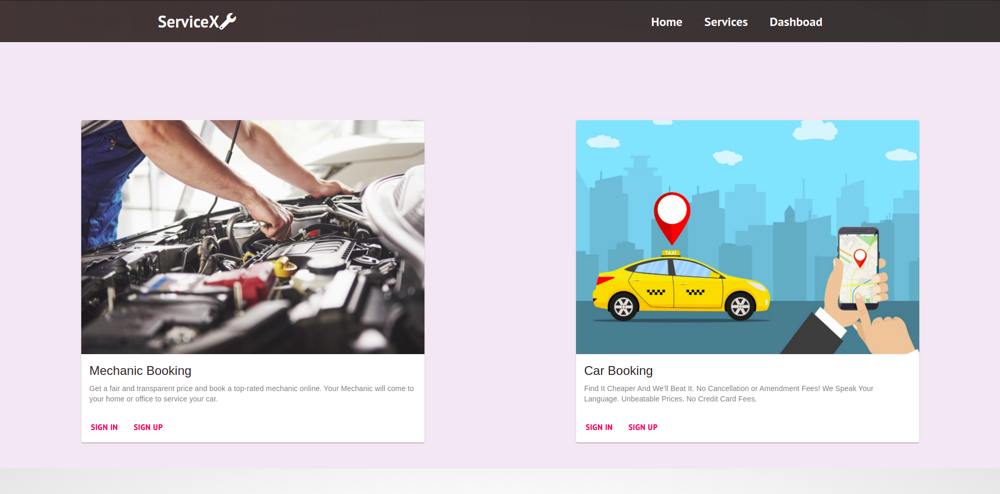
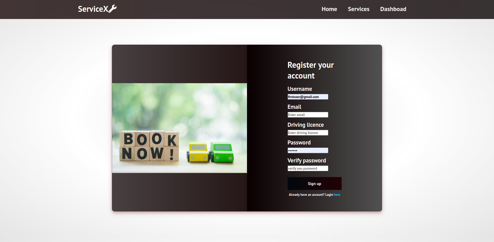
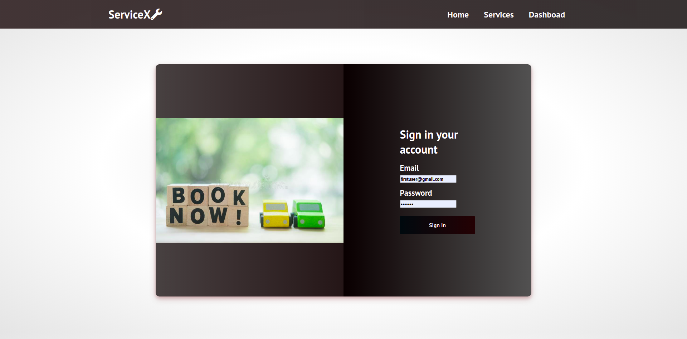
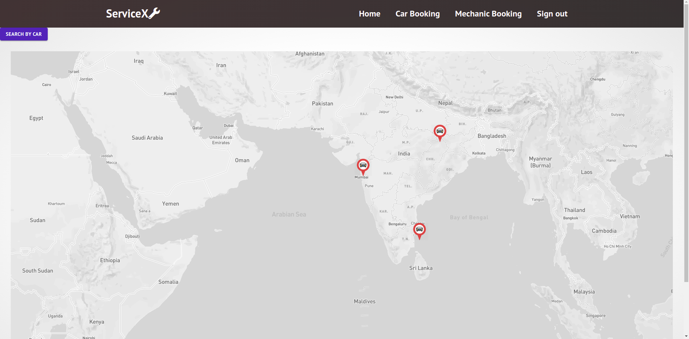
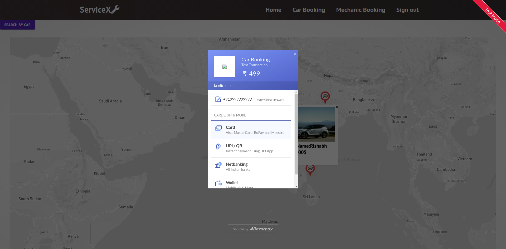
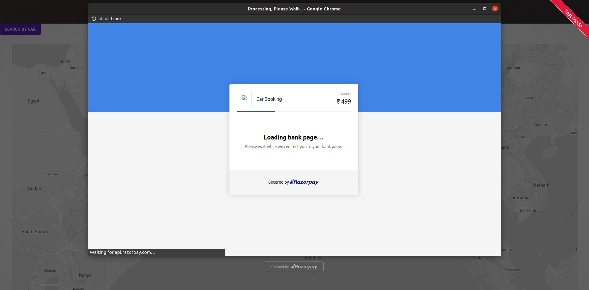

# ServiceX
An enterprise application development project built using MERN stack. Main purpose of the project is to provide vehicle rental services to the people who are in need of it.
## Services offered
* Car Booking
* Mechanic Booking
## Technologies used
* JSX
* CSS
* Web frameworks(Bootstarp)
* Javascript

## APIs consumed
* Mapbox
* Razorpay

### Home page

### Services page

### Authentication pages

### Car booking page

### Mechanic booking page

# Payment page

# ServiceX
